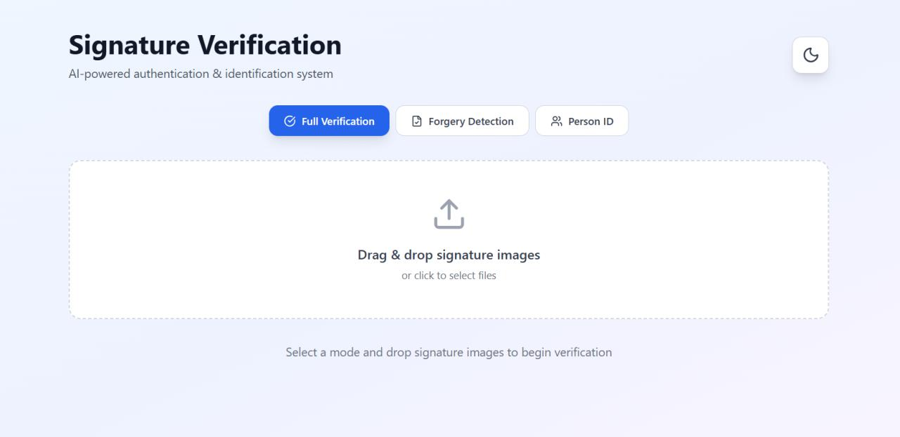

# Offline Signature Verification Using Deep Learning

AI-powered web system for verifying handwritten signatures from images. The system combines three deep learning models into a single ensemble to determine whether a signature is genuine or forged, achieving **94.44% accuracy**.

## Demo



The web interface supports three modes: full verification, standalone forgery detection, and person identification from a signature image.

## Problem

Manual signature verification is slow, subjective, and error-prone — a real bottleneck in banking, legal document processing, and identity verification. This project automates the process using computer vision and deep learning, removing the need for manual visual comparison.

## How It Works

The system works in two phases:

**Phase 1 — Forgery Detection (Ensemble Model)**
Three independently trained CNN architectures — EfficientNet, ResNet50, and MobileNet — each classify a signature as real or forged. Their predictions are combined using weighted ensemble averaging (EfficientNet: 0.4, ResNet50: 0.35, MobileNet: 0.25) to produce a more robust final decision than any single model alone. Per-person decision thresholds are used to account for natural variation in individual signing styles.

**Phase 2 — Person Identification**
A separate EfficientNetB3 model identifies which of the 9 enrolled individuals a given signature belongs to, achieving 100% identification accuracy on the evaluation set.

The Flask backend exposes both phases through a REST API, which the React frontend calls to run verification, forgery detection, or person ID — either on a single image or in batch.

## Tech Stack

**Backend:** Python, Flask, TensorFlow/Keras
**Frontend:** React, Vite, Tailwind CSS, Axios
**ML:** EfficientNet, ResNet50, MobileNet (ensemble), EfficientNetB3 (person ID)
**Training:** Google Colab (GPU-accelerated training notebooks)

## Key Features

- Full signature verification (forgery detection + person ID combined)
- Standalone forgery detection mode
- Standalone person identification mode
- Drag-and-drop image upload with batch support
- CSV export of batch results
- Per-person adaptive decision thresholds

## Project Structure

```
.
├── backend/
│   └── signature_system/
│       ├── app/                          # Flask REST API + inference logic
│       ├── signature_models/             # Phase 1: forgery detection (ensemble)
│       └── signature_person_id_simple/   # Phase 2: person identification
├── dataset/                              # 9 persons × 60 images (real + forged)
├── frontend/
│   └── my-project/                       # React + Vite + Tailwind app
└── notebooks/
    ├── forge_vs_real_detection/          # Phase 1 training notebook
    └── person_detection/                 # Phase 2 training notebook
```

## Results

| Metric | Value |
|---|---|
| Forgery detection accuracy (ensemble) | 94.44% |
| Person identification accuracy | 100% |
| Models in ensemble | 3 (EfficientNet, ResNet50, MobileNet) |
| Enrolled persons | 9 |
| Dataset size | 540 images (60 per person) |

Training curves, ROC curves, and detailed results are available in [`backend/signature_system/signature_models`](./backend/signature_system/signature_models).

## Setup

**Backend**
```bash
cd backend/signature_system/app
pip install -r requirements.txt
python app.py
```
Trained model weights (`.h5` files) are not included in this repo due to GitHub's file size limits — see the README inside each model folder for download links.

**Frontend**
```bash
cd frontend/my-project
npm install
npm run dev
```

## Dataset

The dataset consists of 9 individuals, each with 30 genuine and 30 forged signature samples (540 images total). Not included in this repo due to size — available on request.

## What I Learned

Building this project gave me hands-on experience with ensemble learning for improving model robustness, handling class imbalance and per-individual variation in biometric data, and deploying a multi-model ML pipeline behind a usable web interface end to end — from raw image data to a production-style API.

## Author

**Dawood Khan**
Final Year Project, BS Computer Science — University of Science and Technology Bannu
[LinkedIn](https://www.linkedin.com/in/mr-dawoodkhan) · [GitHub](https://github.com/dawoodRepo)